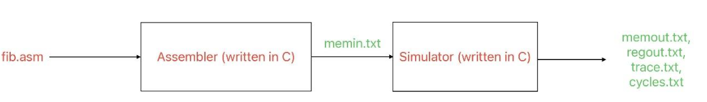

# SIMP Processor Simulator

This project aims to develop a simulator for a RISC type processor named SIMP. The project is divided into three main parts:

1. Writing assembly code to be simulated (`fib.asm`).
2. Developing an assembler that converts the assembly code into machine code.
3. Creating a simulator that executes the machine code.

## Project Overview

The schematic below illustrates the project:



- **Red Parts**: Coded and prepared components.
- **Green Parts**: Output files generated automatically by the software.

## Project Components

### 1. Assembly Code (`fib.asm`)

The assembly code is written for the SIMP processor. For detailed information, refer to the [Project Documentation](Project%20Documentation.pdf).

### 2. Assembler

The assembler, written in C, translates the assembly code into machine code. It is executed using the command line as follows:

```
asm.exe program.asm memin.txt
```

- `program.asm`: Input file containing the assembly program.
- `memin.txt`: Output file containing the memory image, which is used as input for the simulator.

### 3. Simulator

The simulator, also written in C, simulates the fetch-decode-execute loop of the SIMP processor. The simulation concludes when the HALT instruction is executed. The simulator is run from the command line with the following parameters:

```
sim.exe memin.txt memout.txt regout.txt trace.txt cycles.txt
```

- `memin.txt`: Input file containing the memory image.
- `memout.txt`: Output file for the final memory state.
- `regout.txt`: Output file for the final state of the registers.
- `trace.txt`: Output file tracing the execution of instructions.
- `cycles.txt`: Output file containing the number of cycles executed.

## Files

- `fib.asm`: Assembly code for the SIMP processor.
- `asm.exe`: Assembler executable.
- `sim.exe`: Simulator executable.
- `Project Documentation.pdf`: Detailed project documentation.


For more information, refer to the [Project Documentation](Project%20Documentation.pdf).
